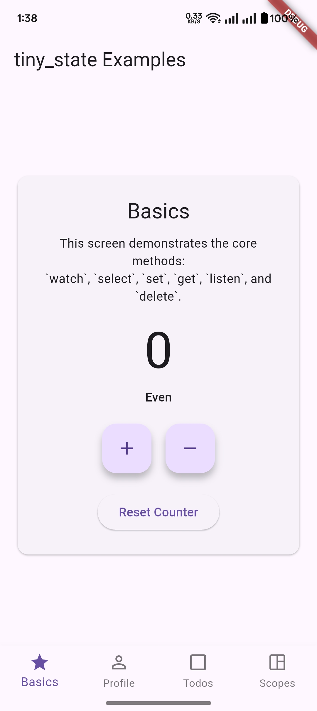
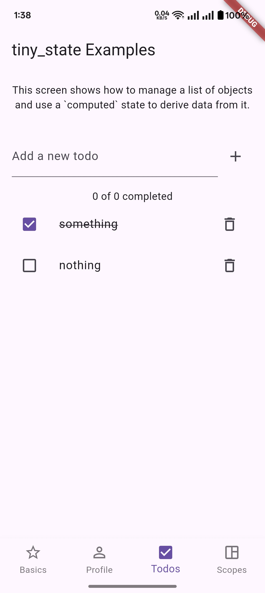
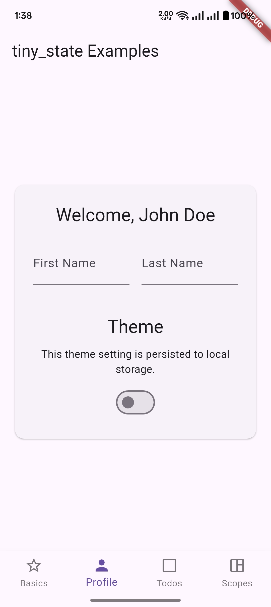
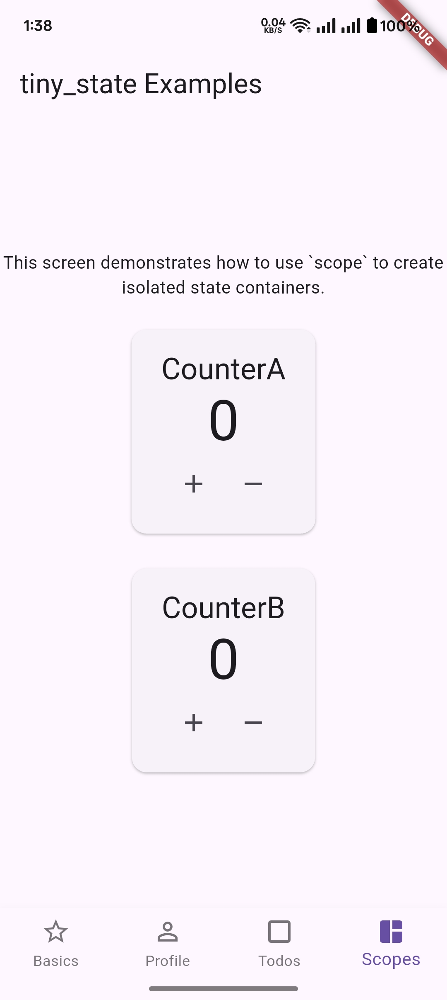

# Tiny State: State Management You'll Actually Want to Use

[](https://github.com/theprantadutta/tiny_state/actions/workflows/build.yml)
[](https://opensource.org/licenses/MIT)

A minimalistic, intuitive, and powerful state management library for Flutter that feels like using a `ValueNotifier`, but global and enhanced. It's designed to be simple, fast, and require zero boilerplate.

## Philosophy: The "Snack Bar" of State Management

`tiny_state` is designed for developers who find other state management solutions like Provider, Riverpod, or BLoC to be overly complex for their needs. It's the "snack bar" of state, not the "all-you-can-eat buffet."

-   **When to use `tiny_state`**: It's perfect for small to medium-sized projects, rapid prototyping, or managing simple, global state (like theme, user authentication, or shopping cart).
-   **When to use other solutions**: For large-scale applications with complex dependency graphs and intricate state logic, more robust solutions like **Riverpod** or **BLoC** are recommended. `tiny_state` is not designed to replace them, but to offer a simpler alternative for simpler problems.

## Features

-   ✅ **Global & Scoped State:** Manage state globally or within specific scopes (`tinyState.scope('name')`) to keep your app organized.
-   ✅ **Reactive UI:** Automatically update your UI when the state changes using `watch`, `select`, and `computed`.
-   ✅ **Type-Safe API:** Catch bugs early with a strict type guard that fires on mismatched generics.
-   ✅ **Selectors:** Watch a transformed, derived value from a piece of state (`tinyState.select(...)`).
-   ✅ **Computed State:** Create state that automatically updates when its dependencies change (`tinyState.computed(...)`).
-   ✅ **Lifecycle Listeners:** Listen to state changes with `fireImmediately`, `once`, and a cancel callback.
-   ✅ **State Persistence:** Persist and rehydrate state across sessions via `TinyStatePersistenceAdapter`.
-   ✅ **Async State:** Built-in support for `Future`s with `watchFuture` and `refreshFuture`.
-   ✅ **Reset & Clear:** Reset a state to its default value, clear a scope, or fully `dispose` the singleton.

## Installation

Add the package to your `pubspec.yaml`:

```bash
flutter pub add tiny_state
```

Then import it:

```dart
import 'package:tiny_state/tiny_state.dart';
```

That's it. The global `tinyState` singleton is ready to use.

## Quick Start

A minimal counter, end-to-end:

```dart
import 'package:flutter/material.dart';
import 'package:tiny_state/tiny_state.dart';

void main() => runApp(const MyApp());

class MyApp extends StatelessWidget {
  const MyApp({super.key});

  @override
  Widget build(BuildContext context) {
    final counter = tinyState.watch<int>('counter', 0);

    return MaterialApp(
      home: Scaffold(
        appBar: AppBar(title: const Text('tiny_state')),
        body: Center(
          child: ValueListenableBuilder<int>(
            valueListenable: counter,
            builder: (_, count, __) => Text('$count', style: const TextStyle(fontSize: 48)),
          ),
        ),
        floatingActionButton: FloatingActionButton(
          onPressed: () => tinyState.update<int>('counter', (n) => n + 1),
          child: const Icon(Icons.add),
        ),
      ),
    );
  }
}
```

## Core API

### `watch`

Initializes state if it doesn't exist and returns a `ValueNotifier<T>` to make your UI reactive.

```dart
final counter = tinyState.watch<int>('counter', 0);
```

### `get`

Reads the current value without subscribing.

```dart
final value = tinyState.get<int>('counter');
```

### `set`

Updates a value and notifies listeners. The key must already exist (call `watch` first).

```dart
tinyState.set<int>('counter', 10);
```

### `update`

Race-safe update based on the current value.

```dart
tinyState.update<int>('counter', (n) => n + 1);
```

### `reset`

Reverts a state to its initial default value.

```dart
tinyState.reset('counter');
```

### `delete`

Removes a state and disposes its notifier (along with any selects watching it).

```dart
tinyState.delete('counter');
```

### `select`

Derives a transformed value from a state. Only notifies when the *transformed* value changes — even if the source changes more often.

```dart
final isEven = tinyState.select<int, bool>('counter', (n) => n.isEven);

ValueListenableBuilder<bool>(
  valueListenable: isEven,
  builder: (_, even, __) => Text(even ? 'Even' : 'Odd'),
);
```

### `computed`

Derives a value from one or more states. Dependencies are tracked automatically by intercepting `tinyState.get(...)` calls inside the computer — re-evaluation is lazy and only happens when a tracked dependency changes.

```dart
tinyState.watch<String>('firstName', 'Jane');
tinyState.watch<String>('lastName', 'Doe');

final fullName = tinyState.computed<String>('fullName', () {
  final first = tinyState.get<String>('firstName') ?? '';
  final last = tinyState.get<String>('lastName') ?? '';
  return '$first $last';
});
```

### `listen`

Listen to state changes with fine-grained control. Returns a cancel callback.

```dart
final cancel = tinyState.listen<int>(
  'counter',
  (value) => print('Counter is now $value'),
  fireImmediately: true, // call once with the current value on subscribe
  once: false,           // remove the listener after the first call
);

// later:
cancel();
```

### `watchFuture` and `refreshFuture`

Track an async operation as a reactive `AsyncSnapshot`.

```dart
final snapshot = tinyState.watchFuture<User>('me', () => api.fetchUser());

ValueListenableBuilder<AsyncSnapshot<User>>(
  valueListenable: snapshot,
  builder: (_, snap, __) {
    if (snap.connectionState == ConnectionState.waiting) {
      return const CircularProgressIndicator();
    }
    if (snap.hasError) return Text('Error: ${snap.error}');
    return Text('Hi, ${snap.data!.name}');
  },
);

// Refresh on demand:
tinyState.refreshFuture('me');

// Or replace the future function:
tinyState.watchFuture<User>('me', () => api.fetchUser(force: true), refresh: true);
```

### `scope`

Create an isolated keyspace to avoid collisions in larger apps.

```dart
final cart = tinyState.scope('cart');
cart.watch<int>('itemCount', 0);     // stored as 'cart/itemCount'
cart.update<int>('itemCount', (n) => n + 1);

cart.clear(); // wipe everything in this scope only
```

### `clear` and `dispose`

```dart
tinyState.clear();   // remove all states; singleton stays usable
tinyState.dispose(); // full teardown: states + computed + adapter; useful for tests
```

## Persistence

Wire up an adapter once during app startup:

```dart
import 'package:shared_preferences/shared_preferences.dart';
import 'package:tiny_state/tiny_state.dart';

void main() async {
  WidgetsFlutterBinding.ensureInitialized();
  final prefs = await SharedPreferences.getInstance();
  tinyState.persistenceAdapter = SharedPreferencesAdapter(prefs);

  runApp(const MyApp());
}
```

Then mark any state as persisted with `persist: true`:

```dart
tinyState.watch<int>('themeMode', ThemeMode.dark.index, persist: true);

tinyState.set<int>('themeMode', ThemeMode.light.index, persist: true);
```

Primitives (`bool`, `int`, `double`, `String`, `List<String>`) are stored natively. Anything else is JSON-encoded.

### Handling deserialization errors

If a stored complex value fails to decode (e.g. after a model schema change), the adapter silently returns `null` by default. Pass an `onError` callback to observe these failures:

```dart
tinyState.persistenceAdapter = SharedPreferencesAdapter(
  prefs,
  onError: (key, error) => debugPrint('Failed to load "$key": $error'),
);
```

### Custom adapters

Implement `TinyStatePersistenceAdapter` to back persistence with anything else (Hive, secure storage, a remote KV store):

```dart
class MyAdapter extends TinyStatePersistenceAdapter {
  @override
  Future<T?> read<T>(String key) async { /* ... */ }

  @override
  Future<void> write<T>(String key, T value) async { /* ... */ }
}

tinyState.persistenceAdapter = MyAdapter();
```

## Type Safety

By default, `tiny_state` enforces a strict type guard: if you `watch<int>('k', 0)` and later call `set<String>('k', 'oops')`, it throws a clear `StateError` instead of silently corrupting state or failing with a confusing cast error elsewhere.

If you have legacy code with intentional type punning, opt out:

```dart
tinyState.strictTypes = false;
```

## Example App

The `example/` directory contains a 5-tab demo app covering every feature:

### Basics Screen
Fundamental methods: `watch`, `get`, `set`, `update`, `reset`, `delete`, plus `select` and `listen`.



### Todos Screen
Managing a list of objects and deriving counts via `computed`.



### Profile Screen
`computed` across multiple inputs (`fullName`) and a persisted theme switch.



### Scoped Screen
Two independent counters demonstrating `scope`-level isolation.



### Persistence Screen *(new in 1.1.0)*
A persisted note and a persisted counter side-by-side with a plain in-memory counter — hot-restart and watch the persisted state survive.

## License

This project is licensed under the MIT License - see the [LICENSE](LICENSE) file for details.
